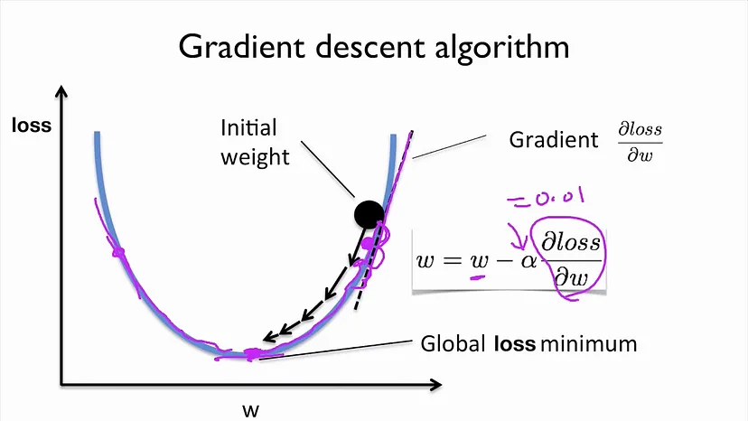

## Optimization Techniques

Optimization techniques are used to adjust the model parameters to minimize (or maximise) the objective function called as Loss function. The process involves in finding the optimal set of parameters among different solutions. 

Few Commonly used Optimization Techiniques are:
1. **Gradient Descent**: Gradient Descent is the first-order iterative optimization alogrithm aimed to minimize the loss the function. The formulae is given by

    $\theta_{t+1} = \theta_t − \alpha * ∇_\theta L(\theta_t)$

    The term $∇_\theta L(\theta_t)$ represents the first derivative of the Loss function w.r.t $\theta$. This component is very important, as it gives the information about the slope of the curve, the objective of this alogrithm is to adjust the parameters in the direction of minimizing the loss. The subtraction ensures that the algorithm is moving in the direction of minimizing loss.

    

    Implemetation of Gradient Descent:
    ```
    def gradient_descent(X, y, w, learning_rate, iterations):
        m = len(y)
        
        for _ in range(iterations):
            predictions = np.dot(X, w)
            errors = predictions - y
            gradient = np.dot(X.T, errors) / m
            w = w - learning_rate * gradient
        
        return w
    ```

    The algorithm suffers with slow rate of convergence, Sensitive to learning rate and can get stuck in local minima and saddle points. 

2. **Stochastic Gradient Descent (SGD)**: SGD is a variation of the gradient descent, where instead of computing the gradient for the whole data set, the gradients are calculated after each data point selected randomly. It is computational efficient (especially for large datasets), memory efficient, achieves faster convergence and can escape local minima due to the its noisy updates.

    $\theta_{t+1} = \theta_t − \alpha * ∇_\theta L(\theta_t, x_i, y_i)$

    where x<sub>i</sub>, y<sub>i</sub> denotes a single datapoint.

    ```
    def stochastic_gradient_descent(X, y, w, learning_rate, iterations):
        m = len(y)
        
        for _ in range(iterations):
            for _ in range(m):
                rand_index = np.random.randint(0, m)
                X_i = X[rand_index]
                y_i = y[rand_index]
                predictions = np.dot(X_i, w)
                errors = predictions - y_i
                gradient = np.dot(X_i.T, errors)
                w = w - learning_rate * gradient
        return w
    ```

    Frequent updates introduces noise which may make it difficult to settle at global minima, sensitive to learning rate and can oscilate near the minima making the convergence difficult.

3. **Mini-Batch Gradient Descent**: A Varient of gradient descnet combining the advantages of both batch gradient descent and the stochastic gradient descent. It udpates the model parameters by computing gradients for small subsets of dataset known as mini-batches. Extreamly helpful for large datasets as data is processed in chunks, and allows for parallelization. It provides the balance between BGD and SGD.

    $\theta_{t+1} = \theta_t − \alpha * ∇_\theta L(\theta_t, X_b, Y_b)$

    where X<sub>b</sub>, Y<sub>b</sub> denotes a single mini-batch of data.

    ```
    def mini_batch_gradient_descent(X, y, w, batch_size, learning_rate, iterations):
        indices = np.arange(len(y))
        np.random.shuffle(indices)
        X = X[indices]
        y = y[indices]
        
        for _ in range(iterations):
            for _ in range(0, m, batch_size):
                rand_index = np.random.randint(0, m)
                X_b = X[i:i+batch_size]
                y_b = y[i:i+batch_size]
                predictions = np.dot(X_b, w)
                errors = predictions - y_b
                gradient = np.dot(X_b.T, errors)
                w = w - learning_rate * gradient
        return w
    ```

    The alogrithms introduces a new hyper-parameter the size of mini-batch and it may lead to potential sub-optimal convergence when the size of mini batch is small.

4. **Mommentun**:  Mommentum is the optimization method used to accelerate the convergence of gradient dwcnet, by dampering the oscialltions and converging quickly towards the global minimum. Instead of updating the parameters only based on the current gradient, momentum incorporates a velocity term, which accumulates the gradients of the past steps to determine the direction of the next update. It helps smooth the updates, reducing oscillations, especially in scenarios with high curvature. Hiigly effective for non-convex optimizations. Helps the optimizer escape shallow local minima due to the accumulated velocity.

    $g_t = ∇_\theta L(\theta_t)$
    
    $v_t = \gamma * v_{t-1} + \alpha * g_t$

    where $\gamma$ is the mommentum factor

    $\theta_{t} = \theta_{t-1} − v_t$

     ```
    def Mommentum(X, y, w, batch_size, learning_rate, mommentum_factor, iterations):
        indices = np.arange(len(y))
        np.random.shuffle(indices)
        X = X[indices]
        y = y[indices]

        vt = np.zeros_like(w)
        
        for _ in range(iterations):
            for _ in range(0, m, batch_size):
                rand_index = np.random.randint(0, m)
                X_b = X[i:i+batch_size]
                y_b = y[i:i+batch_size]
                predictions = np.dot(X_b, w)
                errors = predictions - y_b
                gradient = np.dot(X_b.T, errors)

                vt = mommentum_factor * vt + learning_rate * gradient
                w = w - vt
        return w
    ```

    Introduces the new hyperparameter mommentum_factor, and if not tuned properly can lead to overshooting of the minima.


5. **AdaGrad**: AdaGrad (Adaptive Gradient) algorithm adapts the learning rate of each parameter based on the history of gradients computed for that parameter. it allows the gradient to adjust dynamically, allowing more aggressive updates for infrequent updated parameters and smaller updates for frequently updated parameters. The algorithm keeps the track of squared sum of the gradients, which is used to adjust the lr. This algorithm helps the model to converge faster and useful for convex optimizations. Performs well when the parameters need different learning rates. 

    $g_t = ∇_\theta L(\theta_t)$
    
    $G_t = G_{t-1} + g_t^2$

    $\theta_{t} = \theta_{t-1} − \frac{\alpha}{\sqrt{G_t + \epsilon}} * g_t$

    ```
    def AdaGrad(X, y, w, batch_size, learning_rate, iterations):
        indices = np.arange(len(y))
        np.random.shuffle(indices)
        X = X[indices]
        y = y[indices]

        Gt = np.zeros_like(w)
        
        for _ in range(iterations):
            for _ in range(0, m, batch_size):
                rand_index = np.random.randint(0, m)
                X_b = X[i:i+batch_size]
                y_b = y[i:i+batch_size]
                predictions = np.dot(X_b, w)
                errors = predictions - y_b
                gradient = np.dot(X_b.T, errors)

                Gt = Gt + gradient**2 
                w = w - learning_rate / np.sqrt(Gt + epsilon) * gradient
        return w
    ```

    The algorithm suffers from decaying learning rate due to accumulation of squared gradients and is not ideal for non convex optimization problems.


6. **RMSprop**: RMSprop (Root Mean Square Propogation) is an algorithm designed to adress the limitations in Gradient descent, . The algorithm maintains the moving average of the squared gradients which allows to adapt the learning rate individually to each parameter by the moving average. This helps the alogrithm to reduce the learning rate for high gradients and increase the rate at small gradients. The alogrithm is highly effective for non-convex optimizations, Automatically updates the learning rate and stabilizes the udpates due to the moveing average of the gradients.

    $g_t = ∇_\theta L(\theta_t)$

    $E[g^2]_t = \beta *  E[g^2]_{t−1} + (1− \beta)g_t^2$

    where $\beta$ is the decay rate

    $\theta_{t} = \theta_{t-1} − \frac{\alpha}{\sqrt{E[g^2]_t + \epsilon}} * g_t$

    ```
    def RMSprop(X, y, w, batch_size, learning_rate, decay_rate, iterations):
        indices = np.arange(len(y))
        np.random.shuffle(indices)
        X = X[indices]
        y = y[indices]

        Eg2 = np.zeros_like(w)
        
        for _ in range(iterations):
            for _ in range(0, m, batch_size):
                rand_index = np.random.randint(0, m)
                X_b = X[i:i+batch_size]
                y_b = y[i:i+batch_size]
                predictions = np.dot(X_b, w)
                errors = predictions - y_b
                gradient = np.dot(X_b.T, errors)

                Eg2 = decay_rate * Eg2 + (1 - decay_rate) * gradient**2 
                w = w - learning_rate / np.sqrt(Eg2 + epsilon) * gradient
        return w
    ```

    Despite being adaptive it requries tuning of the inital learning rate along with new hyper parameters $\alpha$ and $\beta$.

7. **Adam**: Adam (Adaptive momment estimation) is the most used algorithm which combines both the ideas of mommentum and RMSprop, providing an efficient and adaptive learning rate for each parameter. It maintains exponentially decaying average of the past gradients similar to momentum along with exponentially decaying average of the squared gradients, similar to RMSprop. After that both the terms are bias corrected to account for the fact that the moving averages are initialized to zero and hence biased towards zero, especially during the initial time steps. Automatically adjusts the learning rate for each parameter, making it efficient in handling sparse gradients. Combination of both the algorithm leads to faster convergence and bias correction improves the algorithms stability in the initial phase of training.

    $g_t = ∇_\theta L(\theta_t)$
    
    $m_t = \beta_1 * m_{t-1} + (1 - \beta_1) * g_t$

    where $\beta_1$ is the decay rate for the first momment (mommentum)

    $v_t = \beta_2 * v_{t−1} + (1 − \beta_2) * g_t^2$

    where $\beta_2$ is the decay rate for the first momment (RMSprop)

    $\hat{m_t} = \frac{m_t}{1-\beta_1^t}, \hat{v_t} = \frac{v_t}{1-\beta_2^t}$

    $\theta_{t} = \theta_{t-1} − \frac{\alpha}{\sqrt{\hat{v_t} + \epsilon}} * \hat{m_t}$


    ```
    def Adam(X, y, w, batch_size, learning_rate, decay_rate1, decay_rate2, iterations):
        indices = np.arange(len(y))
        np.random.shuffle(indices)
        X = X[indices]
        y = y[indices]

        vt = np.zeros_like(w)
        mt = np.zeros_like(w)
        
        for _ in range(iterations):
            for _ in range(0, m, batch_size):
                rand_index = np.random.randint(0, m)
                X_b = X[i:i+batch_size]
                y_b = y[i:i+batch_size]
                predictions = np.dot(X_b, w)
                errors = predictions - y_b
                gradient = np.dot(X_b.T, errors)

                mt = decay_rate1 * mt + (1 - decay_rate1) * gradient
                vt = decay_rate2 * vt + (1 - decay_rate2) * gradient**2
                m_hat = mt/(1 - decay_rate1 ** (epoch + 1))
                v_hat = vt/(1 - decay_rate2 ** (epoch + 1))
                w = w - learning_rate / np.sqrt(v_hat + epsilon) * m_hat
        return w
    ```

    The algorithm is most popular and is used in various models, but it needs three hyper parameters to be tuned $learning_rate$, $\beta_1$, $\beta_2$. 
    


