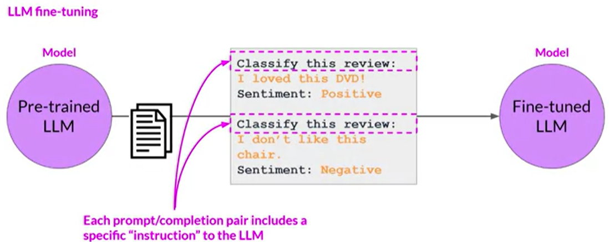
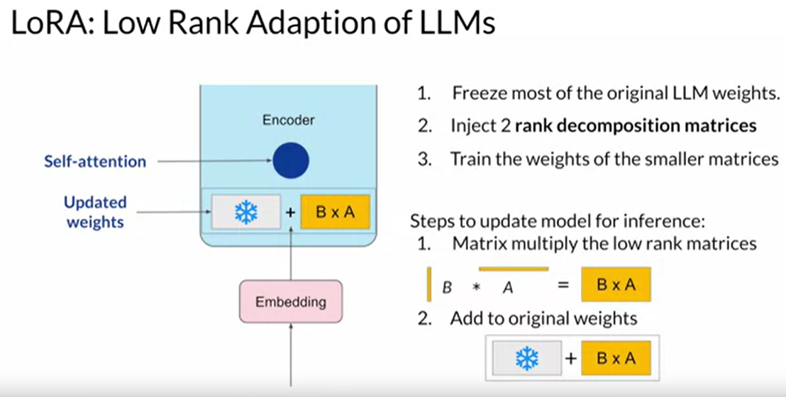
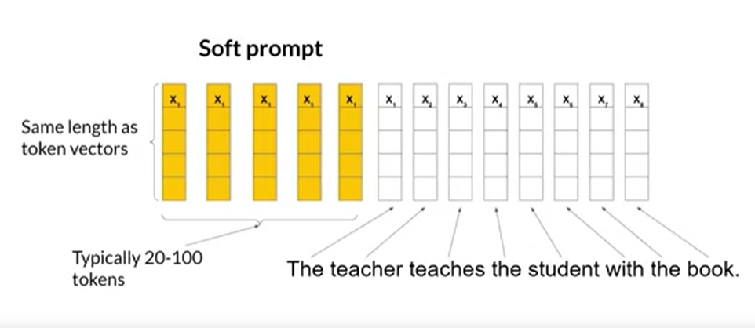
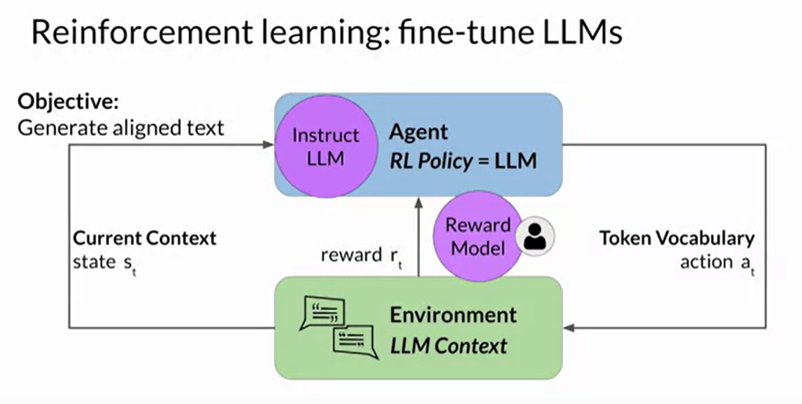

# Fine Tuning Techniques

Fine-tuning is the process of additional training the pre-trained llm to
specialize in the given domian/application. The pre-trained llms are trained on
large amount of general data from various sepcific domains, to understand the
general relations and patterns in the vocabulary and understading common things.
Pre-trained llms may not be ready to be utilized in the applications which
require specialized knowledge in the given domain. Hence the Pre-trained data is
fine-tuned on additional domain specific data to understand and specilize the
nuances in the domain for Domain Adoption.

There are two approaches of fine-tuning data:

1. **Feature extraction**: This approach is used, when the pre-trained model has
   already learned all the majority of the patterns on the large scale of data,
   and this is used as a base for the domain specific knowledge. hence, all the
   layers of the model are kept frozen and only the final layers are
   trained/repurposed to learn and adapt to the specific task.

2. **Full fine-tuning**: It is used, when the pretrained data is much different
   from the fine-tuning data, but the pre-trained parameters helps as a good
   initialization for the data. In this approach all the layers of the model are
   used in the training process.

On a broad scale the fine-tuning techniques can be seperated as:

1. Supervised Fine-tuning (SFT)
2. Unsupervised Fine-tuning (UFT)

## Supervised Fine-tuning (SFT)

Supervised fine-tuning techniques involves in finetuning the model with
supervised data, which contains labelled datasets. Various techniques invovled
in SFT are:

### Instruction Fine-Tuning

Instruction fine-tuning involves dine-tuning the data on instruction-response
which has specific instructions forcing the model to learn to respond to the
instructions. This method improves in-context learning (zero-short and few-short
learning).

Types of Instruction fine-tuning:

1. **Single-Task Learing**: In this method, the model is fine-tuned on a
   single-instruction, this may lead to a state called catastrophic forgetting,
   as the model is specialised in one task it will degrades the performance on
   other tasks.

2. **Multi-Task Learning**: Unlike Single-Task Learing, this method
   simultaneously trains the data on mulitple-tasks which helps on reducing the
   catastrophic forgetting and help the model to takle diverse tasks.

### PEFT (Parameter efficient fine-tuning)

Full Fine-tuning of the data is memeory intensive, as it requires memory to
store trainable weights, gradients, temp storage, optimizer states etc. Hence
PEFT methodologies keeps maximum of the layers froze, and updates the weights of
only few layers (new or existing). As most of the model is untouched it requries
very less computation (1 GPU) and they are less prone to catastrophic
forgetting.

The PEFT methods are categorized in two-types:

1. **Selective Methods**: Selective methods updates the existing layers, a
   subset of trainable parameters.

2. **Additive Methods**: These methods carry out fine-tuning by keeping all of
   the original LLM weights frozen and introducing new trainable components. The
   two main approaches are:

   a. **Adaptive Methods**: These methods add new trainable layers to the
   architecture of the model, typically inside the encoder or decoder components
   after the attention or feed-forward layers.

   b. **Soft prompt Methods**: Soft prompt methods, on the other hand, keep the
   model architecture fixed and frozen, and focus on manipulating the input to
   achieve better performance. This can be done by adding trainable parameters
   to the prompt embeddings or keeping the input fixed and retraining the
   embedding weights.

   #### Low Rank Adaptation (LORA)

   In LORA, most of the LLM weights are kept frozen and a 2 rank decomposition
   matrices are added which on multiplying has the same size of the original
   parameters, these are added together.

   

   Because this model has the same number of parameters as the original, there
   is little to no impact on inference latency. Researchers have found that
   applying LoRA to just the self-attention layers of the model is often enough
   to fine-tune for a task and achieve performance gains. However, in principle,
   you can also use LoRA on other components like the feed-forward layers. But
   since most of the parameters of LLMs are in the attention layers, you get the
   biggest savings in trainable parameters by applying LoRA to these weights
   matrices.

   Since the rank-decomposition matrices are small, you can fine-tune a
   different set for each task and then switch them out at inference time by
   updating the weights. The performance of the LORA is much closer to that of
   the fine-tuning with less parameters trainable.

   #### QLORA

   Quantized LORA is extended version of LORA, aims to reduce the memory
   footprint of finetuning of the LLMs making it feasible to run on single GPU.
   This approach introduces multiple innovations

   1. 4-bit Normal float: Normally f;oat32 is used to store weights in deep
      learning models which increases memory footprint. To reduce the memory
      foot print, 4 bit Normal floats are used to store the weights in this
      approach. As the 4 bit float has only 16 values, the range of the weights
      i.e. -1 to 1, into 16 bins and then the values are associated as the index
      of the nearest bin.

      This method introduces outliers as the distribution of the weights can be
      skewed, this may result into under utilization of the bins, to avoid this
      k-bit quantization is used. The weigths are divided into blocks and each
      block is quantized independently. This approach gives higher quantization
      precision and stability.

   2. Double Quantization: After the first round of quantization the average
      memory constraint for a single weight param is 4 bit + 32 / 64
      (considering each block of size 64, and a 32 bit is used to store the min
      and scale values). The second step of quantization is targetted to reduce
      this memory footprint to store the quantized information. The min
      (zero-point and scale parameters) are further quantized to 8 bit precision
      and grouped into chunks of 256. This results into 4 bit + 8 / 64 + 32 /
      256 \* 64.

   3. Paged Optimizers: The concept of Paged optimizers is used to manage memory
      usage during training. The concept of Paged optimizers is used to manage
      memory usage during training. NVIDIA unified memory facilitates automatic
      page-to-page transfers between the CPU and GPU. When the GPU runs out of
      memory, these optimizer states are moved to the CPU RAM and are
      transferred back into GPU memory when needed.

   #### Soft Prompts

   Prompt tuning is a PEFT method, which finetunes the model without changing
   the weights at all. With prompt engineering, you work on the prompts to get
   the completion you want. However, there are some limitations, as it can
   require a lot of manual effort to write and try different prompts. The length
   of the context window is limited, and these still do not achieve the
   performance for the task.

   With prompt tuning, you add additional trainable tokens to your prompt and
   leave it up to the supervised learning process to determine their optimal
   values. These added tokens are called soft prompt and they are prepended to
   the prompt. These tokens may not be any words from the vocabulary but are
   some points in the vector space of the embeddings which optimize the result.
   

   #### Adapter Layers

## Unsupervised Fine-Tuning

### Reinforcement Learning from Human Feedback (RLHF)

The goals of the fine-tuning method were to understand better the task, better
completion and more natural-sounding language. Natural sounding of the language
gives a lot of problems, the llms are facing problems with toxic language,
aggressive responses and providing dangerous information. Aligning models with
human values helps to make the models - HHH (helpfulness, honest and harmless).

RLHF uses reinforcement learning to fine tune the llm with the human feedback
data resulting in the model with human preferences. This helps the model to
maximize helpfulness, relavance, minimize harm and avoid dangerous topics.

In the RL Algorithm, The agent policy is the LLM, the environment is the context
window. The objective is to generate human-aligned text. The state of the LLM is
the current context and the action is the next word generation based on the
probabilities of the token vocabulary, based on the generation a reward to given
based on the closeness of the generation with the objective.

Providing rewards is the main task in RLHF. One way to accomplish this is human
labellers to provide the rewards based on the output, but this is a very
time-consuming task, so we can train a reward model to accomplish the task. This
reward model is trained using the small set of human feedback data, Once trained
the reward model can be used to assess the output of the LLM and assign a reward
value.

To train the reward model, the dataset is prepared using human labellers. Human
labellers are given a set of completions and told to rank the completions in
different aspects of HHH. The reward model learns to rank the generated output.
