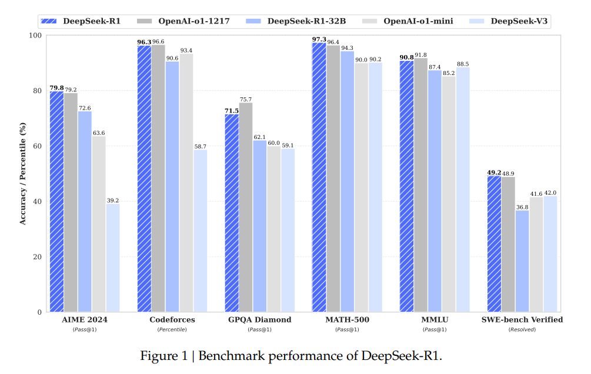
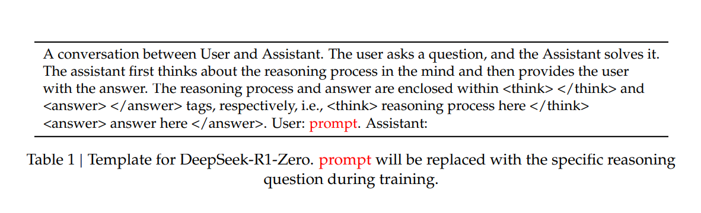

# Reasoning models

### Types of Logical Reasoning
Logical Reasonining can be broadly categorized into 4 categories
1. Deductive Reasoning: This type of reasoning draws conclusion from the general principles. If all the priniciples are true then the conclusion must be true. Ex: If the "Apples are red" and "The fruit is an appe", then it concludes that "The fruit is red". Higly used in the field of mathematics ad formal logic.

2. Inductive Reasoning: Draws conclusions from the given observations, The conclusions may not be true. Observing a lot of white swans, some one can draw that "All swans are white". Highly required for scientific discovery and decision-making.

3. Abductive Reasoning: Draws possible explanation for given information which might be incomplete. Seeing wet spots on road some one can say "It has rained recently". While the explanation may not be true, but it forms an base for hypothesis generation and decision making.

4. Analogical Reasoning: Involves drawing conclusions between similar situations.  By identifying parallels between different scenarios, this enables creative problem-solving and knowledge transfer. The planets orbit around sun in elliptical path which can lead to "other celestial bodies too revolv in elliptical paths".

### Datasets for Logical Reasoning
The datasets can be categorized broadly into 3 categories for specific tasks:

1. Natural Language Inference(NLI): NLI evaluates weather the model is able to give a binary or ternary conclusions based on the given observations.
Ex: ConTRoL - recruitment exams, FOLIO - expert-constructed reasoning based on FOL(First Order Logic), LogicNLI - general logic rules isolating FOL based inference etc

2. Machine Reading Comprehension(MRC): evaluates logical reasoning to questions based on a given passage. 
Ex: LogiQA - Chinese CSE, GSM - mathematical reasoning, LINGOLY - linguistic olympias puzzles etc

3. Benmark suites - used for standardied evaluation of logical reasoning
Ex: GLoRE, LofiGLUE, LogiTorch, BIG-bench.

### Models
The reasoning models can be categorized based on the core strategies:
1. **Data-Centric Approaches**: Data centric approaches try to utilize training datasets to enforce reasoning in the models. Can be expressed as
   
   $D^* = arg max_D R(M_D)$

   where D = training dataset, MD = model trained on D and R is the performace evaluator (LLM-as-a-judge, rule-based metrics)

   The datasets typically are three types: expert-curated datasets, synthetic datasets and LLM distilled datasets.
2. **Model-Centric Approaches**: Model-Centric Approches improves models reasoning capabilities by optimizing model parameters and decoding strategy. They are represented as
   $(\theta^*, S^*) = arg max_{\theta, S} R(M_{\theta}, S)$

   where $\theta$ are learnable model parameters, $M_\theta$ is the model and S is the decoding stategy (chain-of-though prompting, verification-based decoding) and R is the reasoning based decoding.

   The Practical implementations of this approach can be categorized as:

   - **Instruction Fine-Tuning (optimizing θ)**: IST adapts LLMs through supervised learning to mimic resoning processes. Recent publications achieved test-time scaling through long COT samples. 
   - **Reinforcement Learning (optimizing θ)**: Introduction of RL has improved reasoning abilities of the models. OpenAi-o1 uses RL algorithms to produce long COT reasoning. Many studies have implemented Monte Carlo Tree Search (MCTS) have gained fruitfull results. A significant breakthrough has come with DeepSeek-R1 which has proved that training though pure RL algorithms demonstrates impressive reasoning capabilities. Deepseek has usied IFT as a cold start to balance reasonability, language consistancy with reasoning ability. 
   - **Inference-Time Decoding (optimizing S)**: Inference time scaling achieves reasoning without parameter updates. Few approches used are structured outputs and modular workflows. Another approach is making the LLMs to refine their answers in iterative style. Constained decoding methods focuses on improving the controllability and reliability of resoning processes though logic constraints and automata.

3. **External Knowledge Utilization**: This method aids help from External Knowledge source to avoid hallucinations. This method can be represented as 
   
   $(M^*, K^*) = arg max_{M, K} R(M, K)$

   where M is the neural model which also include decoding strategy (the params are unchanged), K is the knowledge source and R is the resoning performace evaluator.

   recent works achieved results by using this method and decomposing the problem and resoning steps into sub-steps.

4. **Neuro-Symbolic Approaches**: This method tries to embedd inpretability of symbolic reasoning to improve reasoning. The objective is expressed as:
   
   $(M^*, P^*) = argmax_{M, P} R(P(M(x)))$

   where M is the model with decoding strategy, which maps the input into symblic representation i.e. z = M(x). 
   
   P is the symbolic solver which converts the representation to the final output i.e. y = P(x). 
   
   R is the reasoning performance metric.

   The optimization goal is to improve M and enhance P, which jointly strengths both neural nets and the symblic reasoning. Unlike the older pipelines which only focus on M, keeping P externally, the recent works overcomes the limitations posed by the predicisors. 

### Current Challenges and Future Direction
LLMs exhibit inconsistent performance in structured reasoning tasks such as deductive inference and abductive hypothesis generation. This
inconsistency arises from their reliance on surface-level statistical correlations rather than causal relationships, coupled
with limited out-of-distribution generalization. 

The models fail to generalize the reasoning ability as humans as many models are narrowly task specific. Data-Driven models despite being generalized they struggle beyond syntactic patterns.

The current Evaluation benchmarks lacks a holistic assessment.

Can LLMs achieve human-like robustness without sacrificing cross-domain adaptability?
How can we reconcile transparent reasoning with black-box model performance?
What defines a gold standard for logical reasoning evaluation?

Resources:
Logical Reasoning in Large Language Models: A Survey

## Popular Reasoning models

### OpenAI o1

### DeepSeek R1

The paper introduces new reasoning models, DeepSeek-R1-Zero and DeepSeek-R1. The DeepSeek-R1-Zero was trained via large-scale reinforcement learning (RL) without supervised fine-tuning (SFT) resulting in great reasoning abilites. However, it faces poor readability, and language mixing problems. To overcome these problems,  Deepseek-R1 was introduced, uses SFT data as the cold-start data before RL. DeepSeekR1 achieves performance comparable to OpenAI-o1-1217 on reasoning tasks inspite of its smaller size.

<!-- 

1. Collecting thousands of cold-start data to fine-tune the DeepSeek-V3-Base
   model.
2. Following this, Reasoning-oriented RL (GRPO) is performed like
   DeepSeek-R1-Zero.
3. Upon nearing convergence in the RL process, new Supervised Fine Tuning data
   through rejection sampling on the RL checkpoint, combined with supervised
   data from DeepSeek-V3 in domains such as writing, factual QA, and
   self-cognition, and then retrain the DeepSeek-V3-Base model.
4. After fine-tuning with the new data, the checkpoint undergoes an additional
   RL process, taking into account prompts from all scenarios.
5. After these steps, a checkpoint is obtained referring to as DeepSeek-R1,
   which achieves performance on par with OpenAI-o1-1217.

Further the deepseek-R1 is distilled into smaller dense models. Rather than
applying RL directly to Qwen25-32B, Direct distillation from deepseek-r1 has
outperformed the other sota models, demonstrating that the reasoning patterns
discovered by larger base models are crucial for improving reasoning
capabilities. distilled Qwen and LLama models have been opensourced.

### Contribution

The major contributions of this paper are:

1. **Large-Scale Reinforcement Learning on Base models**: The paper has
   validated that reasoning capabilities of the LLMs can be imporved thorough
   RL, without the need of the SFT. This approach allowed the Deepseek-R1-Zero
   model to explore COT (Chain-Of-Though) to solve complex problems, which
   resulted in capabilities like self-verification, reflection, and generating
   long CoTs. For the Deepseel-R1 model 2 stages of RL was incorporated with 2
   stages of SFT, to improve the models non-reasoning and language skills.

2. **Smaller Models Can Be Powerful Too**: The paper demonstrates that the small
   dense modelled distilled from base models perform well rather than applying
   RL directly on smaller models. The evaluation results demonstrate that the
   distilled smaller dense models perform exceptionally well on benchmarks.

### Architecture - DeepSeek-R1-Zero

The models use DeepSeek-V3 as base model.

1. **Group Relative Policy Optimization (GPRO)**: The model uses GRPO for RL,
   which uses a critic model typically of the same size of the policy model, and
   it estimates the basline from the group scores. Specifically, for each
   question 𝑞, GRPO samples a group of outputs {o1, o1, ·
   · · , oG} from the old policy 𝜋𝜃𝑜𝑙𝑑 and then optimizes the policy
   model $\pi_\theta$ by maximizing the following objective:

   $ J*{GRPO}(\theta) = \frac {1}{G} \sum*{i=1}^{G} (
   min(\frac{\pi*\theta(o_i|q)}{\pi*{\theta*{old}}(o_i|q)} A_i,
   clip(\frac{\pi*\theta(o*i|q)}{\pi*{\theta*{old}}(o_i|q)}, 1 - \epsilon, 1 +
   \epsilon) A_i) - \beta D*{KL} (\pi*\theta || \pi*{ref}))$

   where
   $D_{KL} (\pi_\theta || \pi_{ref}) = \frac{\pi_{ref}(o_i|q)}{\pi_\theta(o_i|q)} - log\frac{\pi_{ref}(o_i|q)}{\pi_\theta(o_i|q)}$ -
   1

   $\epsilon$ and $\beta$ are hyper parameters, , and A_i is the advantage,
   computed using a group of rewards {r_1,r_2, . . . ,r_G} corresponding to the
   outputs within each group:

   $A_i = \frac {r_i − m𝑒𝑎𝑛({r_1,r_2, · · · ,r_G})} {s𝑡𝑑({r_1,r_2, · · · ,r_G})}$

2. **Reward Modellng**: A rule based reward system with two types of rewards are
   employed:

   a. **Accuracy Reward**: It evaluates weather the reward is correct or not. b.
   **Format Reward**: An additional Format reward is added, which forces the
   model to put its thinking process betwee <think></think> tokens.

   The paper didn't use neural reward model as it suffers from reward hacking in
   large-scale RL process.

3. **Training Template**: A template as depicted in the figure is used in the
   training process. This process is required to force the model to undergo
   reasoning process and then produce the output. This allows to observe the
   models RL's process.

   

### Architecture - DeepSeek-R1

The Architecture of the DeepSeek-R1 is mainly to address the short commings of
the DeepSeek-R1-Zero model by the following questions

1. To prevent the early start unstablility in the RL training, can we improve
   the reasoning of the model by adding high-quality cold-start data?
2. How to train a model which also have a strong general capabilities apart from
   Chain-of-Thought (COT) capabilities.

To address these issue, the pipeline consists of 4 stages:

1.  **Cold Start**: to prevent early start unstability a small amont of
    coldstart data which consisits of long COT data collected through directly
    prompting DeepSeek-R1- Zero to generate detailed answers with reflection and
    verification, and refining the results through post-processing by human
    annotators.

2.  **Reasoning-oriented Reinforcement Learning**: After fine-tuning
    DeepSeek-V3-Base on the cold start data, we apply the same large-scale
    reinforcement learning training process as employed in DeepSeek-R1-Zero.
    This phase is used to improve the model's reasoning capabilities. During
    training, the model suffer from language mixing, while handling prompts
    involving differnt languages. To avoid this, language consistancy reward is
    introduced, which is calculated as the proportion of target language words
    in the CoT.

3.  **Rejection Sampling and SFT**: When reasoning-oreiented RL converges, the
    checkpoint is utilized to generate SFT data for the subsequent rounds. This
    data is utilized to improve model's capabilities in writing, role-playing,
    and other general-purpose tasks.

    reasoning prompts and reasoning trajectories are curated from the checkpoint
    using the rejection sampling.

    > rejection sampling is a technique to generate smaples from complex
    > probability distribution by sampling from a simpler proposal distribution
    > and rejecting certain samples to match the target distribution.

    Along with the data used to perform RL, which can be evaluated using
    rule-based rewards, it contains additional data which uses a generative
    reward model by feeding the ground-truth and model predictions into
    DeepSeek-V3 for judgment.

    For non-reasoning data, DeepSeek-V3 pipeline is reused along with the SFT data
    of that model. Part of the data is first inputed to DeepSeek-V3 to generate a
    potential chain-of-thoughtx.  -->
