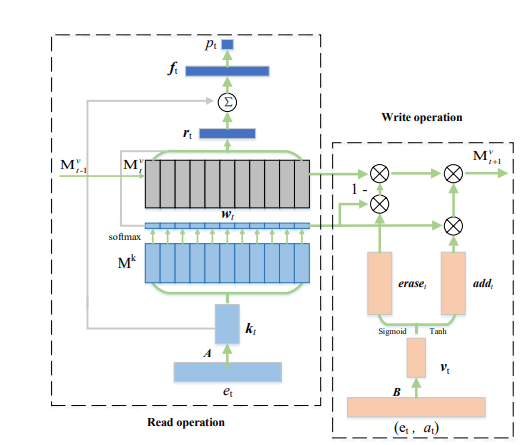
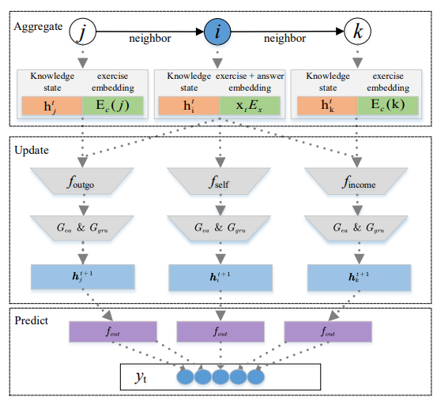

## Bayesian Models

### Bayesian Knowledge Transfer

Bayesian Knowledge Tracing is a probabilistic model to track the sudent's
knowledge based on their interactive history with learning materials. It tries
to estimate if he mastered a specific skill or concept based on the past
performance.

The key parameters are:

1. Knowledge at given time - P(Lt)
2. Learning rate - P(T) - probability that a student learns after an attempt
3. Guessing - P(G) - probability that a student guesses a right answer without
   knowing it
4. Slipping - P(S) - probability that a student makes a mistake despite knowing
   the skill

the Probability which can be derived from the given parameters are:

1.  Probability of Initial Knowledge - P(L0) Probability that the
    student knows the topics without any attempt

2.  Probability of the correct response at given time t

    $P(C_t) = P(L_t)(1 - P(S)) + (1 - P(L_t))P(G)$

    In normal terms P(correct answer) = P(knowing) _ P(not slipping) + P(not
    knowing) _ P(guessing)

3.  Probability of knowledge update after a response -

    a. If the response is correct (Ct = 1)

    $P(L_t|C_t) = \frac{P(L_t)(1 - P(S))}{P(L_t)(1 - P(S)) + (1 -P(L_t))P(G)}$

    This implies as follows:

    $P(knowing|correct) = \frac{P(knowing) * P(not slipping)}{P(knowing) * P(not slipping) + P(not knowing) * P(guessing)}$

    b. If the response is incorrect (Ct = 0)

    $P(L_t|C_t) = \frac{P(L_t)(P(S))}{P(L_t)(P(S)) + (1 - P(L_t))(1 - P(G))}$

    This implies as follows:

    $P(knowing|correct) = \frac{P(knowing) * P(slipping)}{P(knowing) * P(slipping) + P(not knowing) * P(not guessing)}$

4.  Knowledge progression (Learning over time) The Probability that a student
    knows the skill in the next time step (𝑡+1) depends on whether they learned
    it during the current attempt:

        $P(L_{t+1}) = P(L_t|C_t) + (1 - P(L_t|C_t))P(T)$

        This implies
        P(knowing in next time step) = P(knowing|correct) + (1 - P(knowing|correct)) * P(learning)

### Dynamic Bayesian Knowledge Transfer (DBKT)

Dynamic Bayesian Knowledge Transfer is the extension of the BKT which enables
cross skill knowledge transfer and changing learning conditions (e.g., learning
rate, slipping, and guessing probabilities). Unlike BKT, which assumes that
knowledge states are independent for each skill, DBKT models knowledge transfer
between related skills and dynamically adjusts based on student performance.

The probabilities are given as:

1. Knowledge state transisition with transfer

   $P(L_{j, t+1}) = P(L_{j, t}|C_{j, t}) + (1 - P(L_{j, t}|C_{j, t}))P(T_j) + \Sigma_{k \neq j} P(L_{k, t})P(T_{k->j})$

   where,

   $P(L_{j, t})$ is the probability of knowing the skill j at time t

   $P(T_j)$ is the probablitiy of learning skill j

   $P(T_{k->j})$ is the probability of transferring knowledge from skill k to j

2. Probability of correct answer

   $P(C_{j, t}) = P(L_{j, t})(1 - P(S_j)) + (1 - P(L_{j, t}))P(G_j)$

   where

   $P(S_j)$ ad $P(G_j)$ are dynamically updated values based on student
   performance trends

3. Probability of Knowledge update

   $P(L_{j, t}|C_{j, t}) = \frac{P(L_{j, t})(1 - P(S_j))}{P(L_{j, t})(1 - P(S_j)) + (1 -P(L_{j, t}))P(G_j)}$

## Logistic Models

Logistic Models tries to represent the probability of students answering the
questions as the logistic function of student and skill parameters. It first
uses the student interactions to estimate the student and skills parameters,
then these are utilized by an logistic function to estimate the probability of
matery of the skill.

### Learning Factor Analysis (LFA)

Learning Factor analysis analyzes student perfomance by considering the
following factor: Initial Knowledge state, easiness of the skills and learning
rate of skills. It is given as:

$p(\theta) = \sigma (\alpha_{i} S_i + \Sigma_{j} (\beta_j + \gamma_j T_j) K_j)$

where

- $\sigma$ represents the sigmoid function
- $p(\theta)$ is the proabability of getting correct answer
- $\alpha_i$ is the estimate of the initial knowledge state of the student i
- $\beta_j$ is the parameter capturing easiness of the skill j
- $\gamma_j$ is the parameter capturing the learning rate of the skill j
- $S_i$ is the variable for student i
- $T_j$ represents the question-skill matrix (1 if the question is related to
  the skill or else 0)
- $K_j$ is the variable of the skill j

### Performance Factor Analysis (PFA)

Performance Factor Analysis (PFA) predicts the students performance by students
past performance and learning oppurtunities. It is represented as:

$p(\theta) = \sigma (\Sigma_j (\alpha_j + \beta_j s_{i, j} + \gamma f_{i, j} + \delta p_{j}))$

where

- $\alpha_j$ is the estimate of easiness of skill j
- $\beta_j$ and $\gamma_j$ are the parameters for s and f
- $s_{i, j}$ is no of correct responses of student i for skill j
- $f_{i, j}$ is no of incorrect responses of student i for skill j
- $p_{j}$ is total practice questions on skill j - represents effect of repeated
  exposure

### Knowledge Tracing Machines (KTM)

Knowledge Tracing Machines employes factorization machines (FMs) to generalize
logistic models to higher dimensions. This method handles complex dependencies
between various factors such as (skill, student and attempt) by learning latent
representations. It is given as:

$p(\theta) = \sigma (\alpha_0 + \Sigma_i \beta_i X_i + \Sigma_i \Sigma_j v_i v_j X_i X_j)$

where:

- $\alpha_0$ is the global bias term
- $\beta_i$ is the weight for the feature $X_i$
- X_i is the input features (student, skill, past success and past failures)
- v_i and v_j are latent feature vectors for factorized interactions.

## Deep Learning Models

Bayesian and Logistic models fails to caputure the cognitive process at higher
complexity. Deep learnng with its ability to learn non linearity and hidden
feature extraction, it can modell complex learning processes. These models can
be categorized in to 4 sub categories:

### 1. Deep Knowledge Tracing

Deep Knowledge transfer employs Recurrent Neural Networks (RNNs) and its
variants, to trace students knowledge states based on their interactions. They
maintain an hidden state that captures all the past learnings which is used to
represent further states. The model generates an hidden state with eacch
interaction, which provides an high dimensional representation of the students
knowledge.

DKT architecture embedds exercises into a vector space, which are then processed
by the RNN to update the hidden state and produce predictions about students
behaviour of next questions.

$h_t = \tanh(W_{hs}x_t + W_{hh}h_{t-1} + b_h)$

$y_t = \sigma(W_{yh}h_t + b_y)$

where

- $h_t$ is the hidden state at time t
- $x_t$ is the input at time t
- $W_{hs}$ and $W_{hh}$ are the weights for the input and hidden states
- $b_h$ and $b_y$ are the bias terms

Despite its superior results as compared to the Bayesian and logistic methods,
Lack of interpretibility and inconsistant predictions are the drawbacks.

### 2. Memory-aware knowledge tracing

Memory aware Knowledge Tracing are used to enhance the interpretibility of DKT,
by introducing an external memory module helping to store and update the hidden
knowledge state. Dynamic Key-Value Memory Networks (DKVMN) is one such memory
aware model.

The model initalizes a static key matrix to store latent KCs and a dynamic
matrix called a value matrix to sotre and update the mastery of corresponding
KCs through read and write operations over time.

An embedding matrix et is first defined to obtain the embedding
vector kt of the exercises. A correlation weight wt, which
represents the correlation between the exercises and the latent KCs is obtained
by taking the inner product with exercise embedding kt and the key
vector Mk.

$w_t = Softmax(k_t M^k)$

In the read operation, the model predict student's performance based on the
student knowledge representation. Specifically a read content rt is
derived as the weighted sum of all memory vectors in the value matrix using the
correlation weight wt. Further the read content is concatenated with
inupt embeddings and passed to a fully connected layer to yield ft.
Further more the student performance can be predicted by applying another fully
coneected layer with a sigmoid activation.

$r_t = \Sigma_{i=1}^N w_t(i)M_t^v(i)$

$f_t = tanh(W_f[r_t, k_t] + b_f)$

$p_t = \sigma(W_p f_t + b_p)$

In the write operation, after the exercise has been answered, the value matrix
needs to be updated. The model updates it by erase and add operations. The
interaction is passed (et, at) is first embedded with an
embedding matrix B to obatin the student's knowledge growth vt. then
The odel calculate the eraset from vt, it erase the
previous memory with reference to wt. After the erasure, a new memory
vector are updated by the new knowledge state and the add vector
addt.

$erase_t = \sigma(W_ev_t + b_e)$

$\widetilde{M_t^v}(i) = M_{t-1}^v(i)[1-w_t(i)erase_t]$

$add_t = tanh(W_dv_t + b_d)$

$M_t^v(i) = \widetilde{M_t^v}(i) + w_t(i)add_t$

Even though DKVMN has enhanced the interpretability it stills suffer to capture long range dependeincies, to oversome this a new modified LSTM called Hop-LSTM was used in Sequential Key-Value Memory Network (SKVMN). Hop-LSTM helps to capture long-range dependencies by allowing flexible connections between the LSTM cells.

### 3. Attentive knowledge tracing

Transformer has influenced the space of Knowledge tracing a lot. These methods help to capture long-term dependencies between students learning interactions.

However the complexity of KT task limits transfomrer applications. A new approach called Separated Self-Attentive Neural Knowledge Tracing (SAINT), employing an encoder-decoder structure. SAINT+ integrating two temporal features .i.e. time taken to answer and interval time between consecutive learning interactions was introduced. Both these models outperformed transformer based models.

A new approach, introduced  context-aware attentive knowledge tracing (AKT) model. It is composed of 4 modules: Rasch model-based embeddings, exercise encoder, knowledge encoder, and knowledge retriever. 

1. The Rasch model-based embeddings generates embeddings for students and KCs:

    $x_t = c_{c_t} + \mu_{e_t} d_{c_t}$

    where 
    - $c_{c_t}$ is the embedding of the KC 
    - $d_{c_t}$ is the variation in exercise with related KC
    - $\mu_{e_t}$ is the extent of deviation

    Similarly, the exercise-answer tuple (e_t, a_t) is similarly extended using the same equation.

    $y_t = q_{(c_t, a_t)} + \mu_{e_t} d_{(c_t, a_t)}$

2. The exercise encoder converts the exercise embeddings ${e_1, ..., e_t}$ to context-aware embeddings ${\tilde{e_1}, ..., \tilde{e_t}}$, this is achieved by a monotonic attention mechanism where the resulting context-aware embeddin depends on both itself an the previous exercises i.e. $\tilde{e_t} = f_{enc} (e_1, .., e_t)$.

3. Similarly, the knowledge encoding converts the exercise-answer pairs embeddings ${y_1, ..., y_t}$ into context-aware knowledge acquisitions ${\tilde{y_1}, ..., \tilde{y_t}}$

4. Finally the knowledge retriever takes the context-aware exercise embeddings $\tilde{e_{1:t}}$ and exercise-answer pair embeddings as input $\tilde{y_{1:t}}$ to generate knowledge state $h_t$.

AKT uses exponential decay and context-aware relative distance measure to compute the attention weigths rather than the self attention of the transformer model, due to assumption that the learning process is temporal and knowledge will decay over time.

### 4. Graph-based knowledge tracing
Graph based tracing models evovled due to the naturally exisiting graph structure relationships between the KCs. Graph based knowledge tracing (GKT), represents the $V = {v_1, v_2, ..., v_N}$ represent the set of KCs and the edges $E \subseteq V * V$ represents the relations hip between the KCs. $h^t = {h_{i \in V}^t}$ represents the students temporal knowledge after anwering the exercise at time t.

The GKT model contains of three modules: aggregate, update and predict
1. In the aggregate module, GKT aggregates the knowledge state $h_t$ of the answered KC i and its neighboring KCs j. 

    $h_k^{'t} = [h_k^{'t}, a^t E_s] \ if \ (k = i) \ else \ [h_k^{'t}, E_e(k)]$

    where,
    - $a^t$ represents the exercises answered correctly and incorrectly
    - $E_s$ is the embedding matrix for learning interations
    - $E_e(k)$ is the embedding matrix for KC k

2. In the update module, GKT udpates the temportal knowledge state using

    $m_k^{t + 1} = f_{self}(h_k^{'t})\ if \ (k = i) \ else \ f_{neighbor}(h_i^{'t}, h_k^{'t})$

    $\widetilde{m_k^{t + 1}} = G_{ea}(m_k^{t + 1})$

    $h_k^{t + 1} = G_{gru}(\widetilde{m_k^{t + 1}}, h_k^{t})$

    where
    - $f_{self}$ is the multi layer perceptron
    - $f_{neighbor}$ defines the information propagation to neigbor nodes
    - $G_{ea}$ is the erase and add method from DKVMN
    - $G_{gru}$ is the gated recurrent unit

3. In the predict module, the student's performance is predicted using the udpated temporal knowledge state

    $y_k^t = \sigma(W_k h_k^{t+1} + b_k)$

